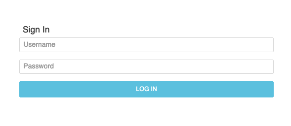

# AgentTesla



```json
{
  "http": {
    "body": {
      "md5": "90819e27b63494e552d0bcdde422f555",
      "mmh3": 1259886487,
      "sha1": "0368893878d56dfadd1426d3df7cfd81ae55a4d2",
      "sha256": "a5d9ba22869b27fb5e383d191077c618894e9a82064c7ceb16d4d50a03235906"
    },
  }
}
```

- [urlscan.io search results](https://urlscan.io/search/#hash%3Aa5d9ba22869b27fb5e383d191077c618894e9a82064c7ceb16d4d50a03235906)

## References

- [Analysis of New Agent Tesla Spyware Variant](https://www.fortinet.com/blog/threat-research/analysis-of-new-agent-tesla-spyware-variant.html)
- [The Rise of Agent Tesla](https://www.digitrustgroup.com/agent-tesla-keylogger/)
